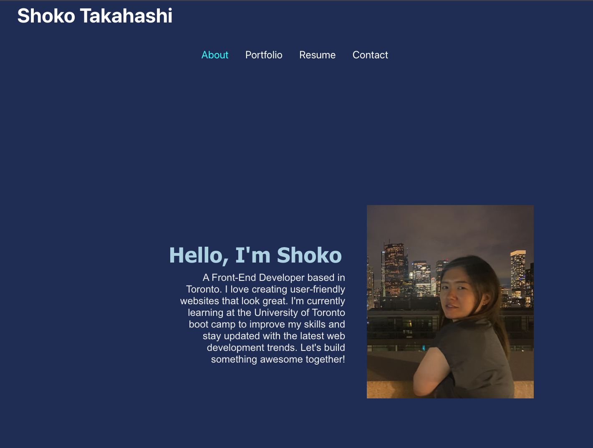
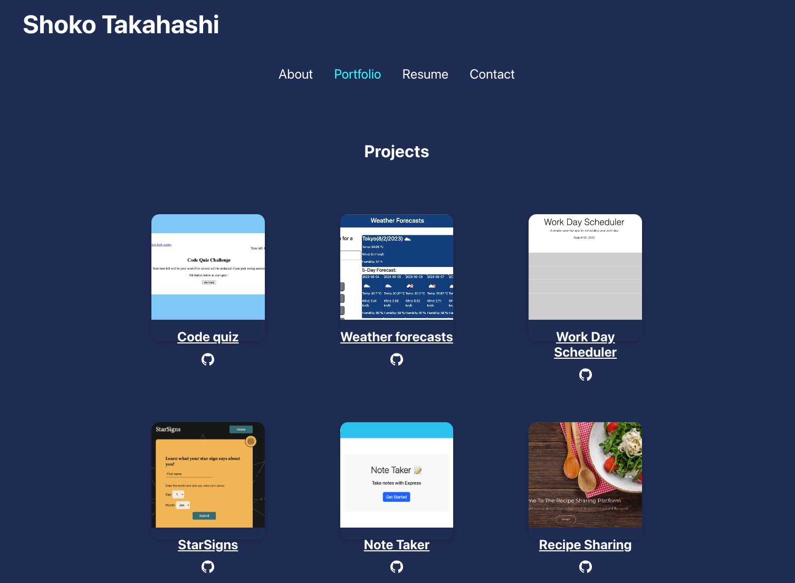
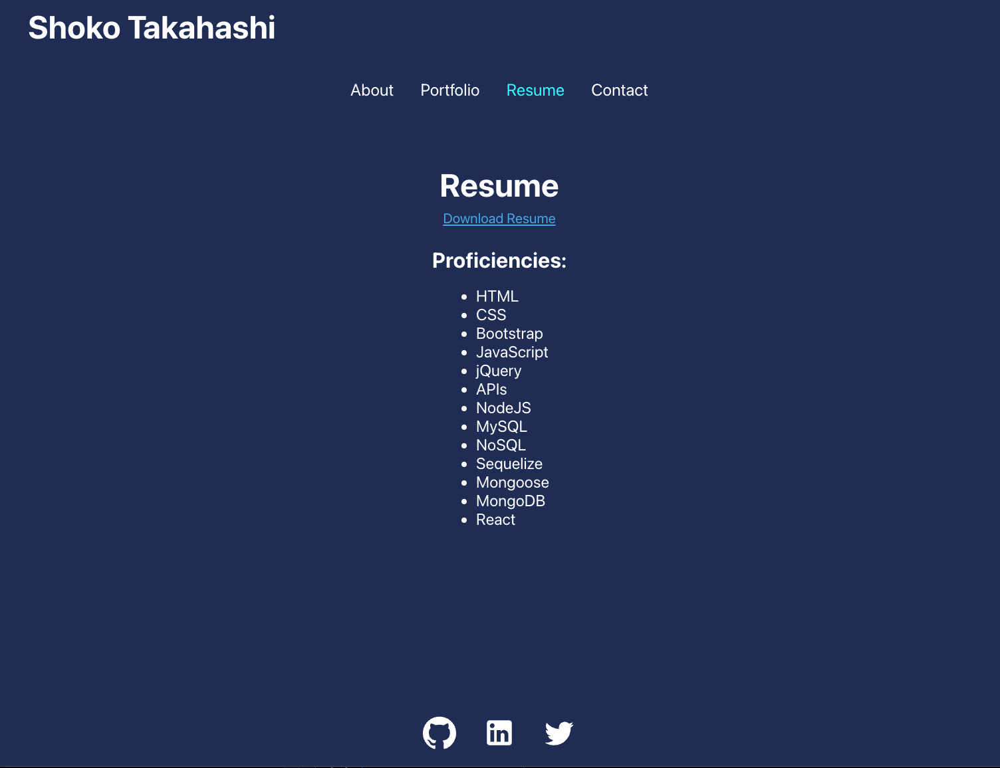
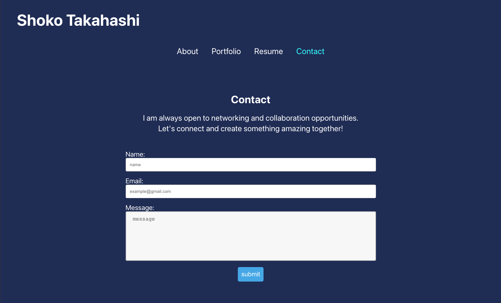

# React portfolio
## Description
This project is a visual record of my web development journey. Through React, I've built this portfolio to spotlight my technical skills and showcase my creative problem-solving. 

## Table of Contents
* [Description](#descriprion)
* [Usage](#usage)
* [Page review](#pagereview)
* [Link](#link)
* [License](#license)

## Technologies Used
- React
- JavaScript
- CSS

## Usage
1. Clone the repository

2. Run `npm install` to install dependencies.

3. Run `npm start` 
   This runs the app in the development mode.\
   Open [http://localhost:3000](http://localhost:3000) to view it in your browser.

## Page review
Home & About page

Portfolio page

Resume page

Contact page

## Link
[Github repository](https://github.com/Shok1to/react-portfolio)

[Github page](https://Shok1to.github.io/react-portfolio)

## License

